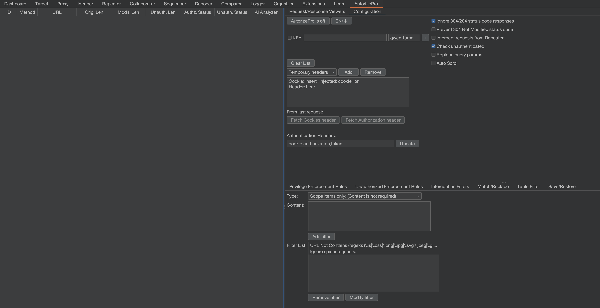
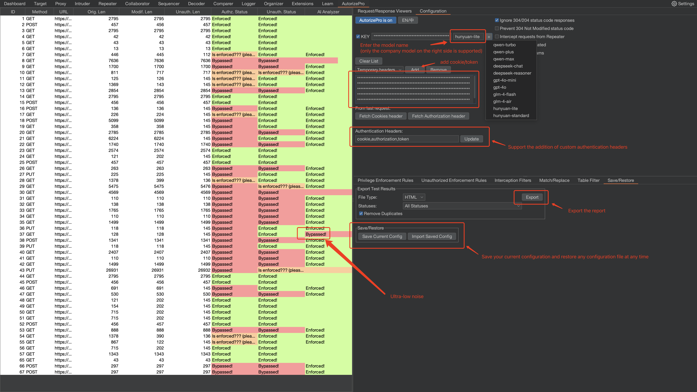
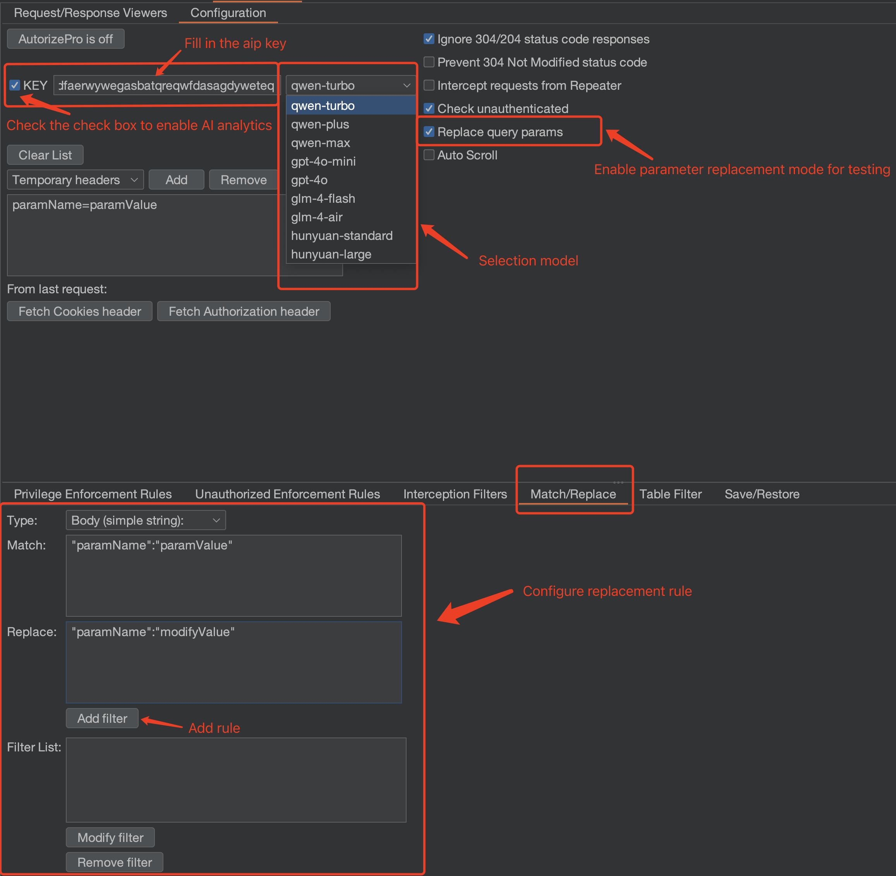

# 🧿 AutorizePro (AI Analysis Module is Live ❤️‍🔥):  
### One-Sentence Introduction: AutorizePro is an innovative Burp plugin with a built-in AI analysis module, specialized in authorization bypass detection. (welcome to Star🌟 )

> **🟣️ When the AI feature is disabled, it uses the standard detection logic. AI analysis is optional but highly recommended. Due to the diverse nature of API responses, rule-based logic often falls short. Enabling AI analysis significantly improves efficiency and accuracy. Time is precious, so let AI handle repetitive and time-consuming tasks. Start discovering vulnerabilities at ten times the speed!**

### Tool Background
- **Broken access control is a must-test in black-box testing and SRC bug hunting, but manual verification is extremely time-consuming.**
- **Traditional authorization testing tools struggle to cover diverse API logic automatically, leading to high false positive rates and limited practicality.**

### Tool Highlights
- **Built-in AI analysis module (optional): reduces the original false positive rate from 95% to 5%, freeing users from manual result triage.**
- **Privacy-friendly: supports analysis using self-hosted/private LLMs within your organization.**
- **🌟 Custom API Support: Configure any OpenAI-compatible API endpoint, supporting locally deployed models (e.g., Ollama) or other vendor models.**
- **Automatically excludes static resources, HTML pages, and error status codes by default—no manual filtering needed.**
- **Supports exporting authorization testing reports in both HTML and CSV formats.**
- **Detailed logs explain AI decisions per request, making it easy to review and fine-tune detection logic.**

## 🔧 Installing AutorizePro
### 1️⃣ Download Burp Suite and Jython

    1. Download Burp Suite: https://portswigger.net/burp/releases
    2. Download the Jython standalone JAR file: https://www.jython.org/download.html

### 2️⃣ Configure Burp Suite’s Python Environment

	1. Open Burp Suite.
	2. Navigate to Extender -> Options.
	3. In the Python Environment section, click Select File.
	4. Choose the Jython standalone JAR file you just downloaded (This project tests the env is: jython 2.7.3, burp suite 2024.11(The built-in java version is java22)).

### 3️⃣ Install the AutorizePro Plugin
	1. Download the latest release ZIP package from the code repository, extract it locally.
	2. Open Burp Suite, navigate to Extender -> Extensions -> Add.
	3. In the Extension Type dropdown, select python.
	4. In the Extension File field, choose the path to the `AutorizePro.py` file from the repository.

### AutorizePro Plugin Successfully Installed 🎉
> 💡 You can adjust the display ratio between the showcase page and the configuration page by dragging the middle sidebar. The configuration interface’s layout can be adjusted by dragging the divider up or down.



## 🔫 Using the AutorizePro Plugin
	1.	Open the configuration tab: click AutorizePro -> Configuration.

	2.	Paste the second account’s authorization header into the textbox labeled “Insert injected header here”. Note: If the header already exists in the request, it will be replaced; otherwise, it will be added as a new header.
	
    3.	If you do not want to perform unauthenticated testing (i.e., requests without any cookies), uncheck Check unauthenticated (enabled by default).
	
    4.	Configure AI Analysis:
       - **Using Default API**: Select a model, enter the corresponding API Key, then check the "Enable AI" checkbox
       - **Using Custom API**: Enter your custom API URL in the URL field (e.g., `http://localhost:11434/v1/chat/completions`), enter the API Key (leave empty if not required), enter the model name, then check the "Enable AI" checkbox
       - AI analysis results will appear in the left-side AI. Analyzer column
	
    5.	Click the AutorizePro is off button to enable the plugin and start testing.
	
    6.	In the left-side results view of the AutorizePro plugin, you’ll see the request URLs and their corresponding access control statuses.
	
    7.	Click on a specific URL in the left panel, then switch to the Request/Response Viewers tab on the right to view the Original, Modified (Auth), and Unauthenticated request/response details for manual inspection.

### 🌠 Example Usage Effect
> 🌟 Drastically reduced false positives: As seen in the image below, after enabling AI analysis, you only need to analyze whether a request is truly unauthorized, saving over 95% of manual analysis effort.

> ⬇️ Test privilege escalation by replacing cookies



> ⬇️ Test privilege escalation by replacing parameters



> View the specific request determined by AI to be unauthorized, and simultaneously display the unauthorized request, original request, and unauthenticated request to easily compare differences.


### ❓ Status Explanation
- **Bypassed! (Red) : Unauthorized Access Detected**
- **Enforced! (Green) : No Unauthorized Access Detected**
- **Is enforced???: Cannot Determine, Configure Enforcement Detector for Assistance**

### 🚰 Filter Configuration: Set Interception Rules in Interception Filters

- You can configure which domains or which requests the plugin should intercept.
- Filters can be based on blacklists, whitelists, regular expressions, or Burp’s scope settings, preventing unnecessary domains from being intercepted, reducing irrelevant request analysis.
- 🌟 The default configuration avoids intercepting scripts and images, but you can add more static resource types to the ignore list.

## 💰 How Much Does the AI Analysis Feature Cost? (By default, detection logic is followed, and AI is only activated when enabled by the user)
- To minimize the costs associated with AI analysis, only packets with equal status codes, JSON format responses, and lengths under 3000 are analyzed when AI analysis is enabled. If conditions are not met, AI analysis will not activate.  
- ⚠️ Note: When enabling AI analysis, you should configure the intercepted domains/rules in Interception Filters to avoid cost overruns caused by analyzing irrelevant sites.
- Personal testing cost example: during high-frequency testing throughout a full day without domain restrictions, the total cost was **¥0.38** (tongyi qwen-plus).
- If you are outside China, you can choose the GPT or use alibabacloud model->[bailian](https://bailian.console.alibabacloud.com/)

## 🌐 Custom API Configuration (Support for Local Models and Other Vendors)
AutorizePro supports custom API endpoints, allowing you to use locally deployed models (e.g., Ollama) or other vendor model services.

### Use Cases
- **Locally Deployed Models**: Use local LLM services like Ollama or LocalAI without API keys, keeping data local
- **Enterprise Private Models**: Use company-internal model services for enhanced data security
- **Other Cloud Providers**: Use other model services that support OpenAI-compatible formats

### Configuration Steps
1. **Enter API URL**: In the configuration page, enter your API endpoint address in the "URL:" field
   - Example (Ollama): `http://localhost:11434/v1/chat/completions`
   - Example (Custom Service): `https://api.your-company.com/v1/chat/completions`
2. **Enter API Key** (Optional):
   - If your API requires authentication, enter the API Key in the "KEY:" field
   - If using local models (e.g., Ollama), leave it empty
3. **Enter Model Name**: Enter the model name you want to use in the model field (when using custom API, any model name is allowed)
4. **Enable AI**: Check the "Enable AI" checkbox

### API Format Requirements
Custom APIs must be compatible with OpenAI's `/v1/chat/completions` format:

**Request Format**:
```json
{
    "model": "your-model-name",
    "messages": [
        {"role": "system", "content": "..."},
        {"role": "user", "content": "..."}
    ]
}
```

**Response Format**:
```json
{
    "choices": [{
        "message": {
            "content": "{\"res\":\"true\",\"reason\":\"...\"}"
        }
    }]
}
```

### Usage Examples

**Example 1: Using Ollama Local Model**
```
URL: http://localhost:11434/v1/chat/completions
KEY: (leave empty)
Model: llama3
```

**Example 2: Using Enterprise Private Model**
```
URL: https://api.company.com/v1/chat/completions
KEY: sk-xxxxxxxxxxxxx
Model: company-model-v2
```

**Example 3: Using Other Cloud Provider**
```
URL: https://api.provider.com/v1/chat/completions
KEY: your-api-key-here
Model: provider-model-name
```

### Notes
- ⚠️ Ensure your API endpoint supports OpenAI-compatible format
- ⚠️ If the API requires authentication, ensure the API Key is correct
- ⚠️ When using custom API, the model name can be any string and will be passed to the API as-is
- 🌟 When using local models, data never leaves your environment, suitable for sensitive data scenarios


## ⛪ Discussion
* Welcome to discuss any tool-related questions [click here](https://github.com/sule01u/AutorizePro/discussions)
* Bug reports or feature suggestions [Click Here](https://github.com/sule01u/AutorizePro/issues)
* PRs Welcome


## 🤗 Acknowledgments
**This product is developed based on the [Autorize](https://github.com/Quitten/Autorize) plugin. Thanks to Barak Tawily.**

## 📑 Licenses

The following disclaimer is added in addition to the original agreement. If there is a conflict with the original agreement, the disclaimer takes precedence.

<u>When using this tool for detection, you must ensure that the behavior complies with local laws and regulations, and you have obtained sufficient authorization. Unauthorized penetration testing is prohibited. Unauthorized penetration testing after secondary development is also prohibited.

If any illegal activity occurs during the use of this tool, you will be solely responsible for the consequences. The developer will not bear any legal or joint liability.</u>

Before using this tool, you must carefully read and fully understand the terms. Limitations, disclaimers, or other clauses involving significant rights and interests may be highlighted with bold or underlined text to draw your attention. Unless you have fully read, understood, and accepted all the terms of this agreement, please do not use this tool. Your use or any other express or implied acceptance of this agreement means you have read and agreed to be bound by its terms.
